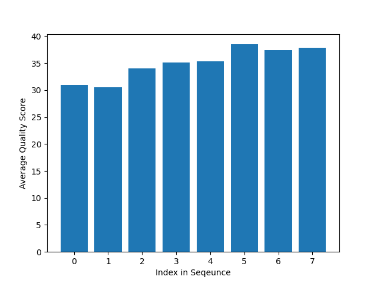

# Assignment the First

## Part 1
1. Be sure to upload your Python script.

| File name | label |
|---|---|
| 1294_S1_L008_R1_001.fastq.gz | Read 1 |
| 1294_S1_L008_R2_001.fastq.gz | Index 1 |
| 1294_S1_L008_R3_001.fastq.gz | Index 2 |
| 1294_S1_L008_R4_001.fastq.gz | Read 2 |

2. Per-base NT distribution
    1. Use markdown to insert your 4 histograms here.
    Read 1:
    
    Read 2:
    
    Index 1:
    
    Index 2:
    
    2. ```
    The histograms show that the average quality score of the indexes is around 35 so that will be the cuttoff used. Biological reads don't need as strict of a cutoff since filtering indexes' quality will also filter out the corresponding biological reads, so their cutoff will be 30.
    ```
    3. ```
	gunzip -c /projects/bgmp/shared/2017_sequencing/1294_S1_L008_R2_001.fastq.gz /projects/bgmp/shared/2017_sequencing/1294_S1_L008_R3_001.fastq.gz | sed -n "2~4p" | grep -c "N" 7304664
	```
    
## Part 2
1. Define the problem
```
We need to separate the records in these fastq files by index. Some of the records have had their index swapped, others have very low quality. These need to be filtered out from the rest of the data.
```
2. Describe output
```
The output will have 2 fastq files for every indexes, where unswapped, high qulity reads from read 1 and read 2 respectivly will go. There will be 2 more files for swapped read 1 and swapped read 2 records and another 2 for reads with low-quality or unexpected indexes from read 1 and read 2 as well. 
```
3. Upload your [4 input FASTQ files](../TEST-input_FASTQ) and your [>=6 expected output FASTQ files](../TEST-output_FASTQ).
4. Pseudocode
```
Open fastq files
Open barcodes.txt
For length of barcodes.txt:
	Open output fastq file

Loop through 4 files
	Make 4 lists for each record (one per file)
If N is in the index OR index not in index-list
	Append index to header
	Put in low quality output file
Revcomp function

If indexes are the same
	Append index to header
	Put in index file
Else
	Append index to header
	Put in swap file

Reportnum function

Close all files

High level functions

Def revcomp(index):
‘’’Takes index, writes complementary strand to it, and then reverses it to get it in 5’ - 3’ direction. Returns the output reverse complement of index.’’’
return reverse complement of "index"

Example input: ACTG
Output: CAGT

Def reportnum(file, category):
‘’’Takes output file and counts the number of read-pairs included in that file’s category. Categories include: “match”, “swap”, “unknown” if the category is swap, function will also return number of unique index combinations.’’’
return string with number of a certain type of index found and what type (match, swap, or unknown) the count is from.

Example input: FASTQ file with 5 properly matched indexes, “match”
Output: “5 matched indexes in FASTQ file”
Example input: FASTQ file with 3 swapped indexes (2 same, 1 unique), “swap”
Output: “3 swapped indexes, 2 AAA CCC, 1 AAA TTT”
```
5. High level functions. For each function, be sure to include:
    1. Description/doc string
    2. Function headers (name and parameters)
    3. Test examples for individual functions
    4. Return statement
